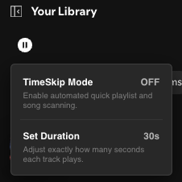

# ⏱️ TimeSkip

<p align="center">
  
</p>

TimeSkip is a native Spicetify extension that gives you precise control over your playlist curation and music discovery. It adds a customizable control button directly to your upper topbar layout next to the marketplace cart icon, allowing you to sample and skip tracks automatically after a specific time duration threshold.

## ✨ Features

- **Automated Skipping:** Focus on discovery by letting your client queue automatically advance after listening.
- **Dynamic Popup Customizer:** Click the topbar icon to quickly change listening thresholds in real-time.
- **Accurate State Indicator:** The button switches colors and symbols instantly to confirm if the engine is running or in standby.
- **Theme-Agnostic Design:** Inherits your default application layout variables, fonts, borders, and dark-mode styles right out-of-the-box.

## 🚀 Installation

### Method 1: Via Spicetify Marketplace (Recommended)
1. Open your Spotify client app.
2. Click on the **Marketplace** icon (the shopping cart) in your top navigation panel.
3. Use the search bar to look up **`TimeSkip`**.
4. Click the **Install** button on the extension card to add it to your configuration automatically.

### Method 2: Manual Local Installation
If you prefer a manual setup or want to test custom modifications:
1. Download `timeskip.js` and move it to your Spicetify Extensions directory:
   - **Windows:** `%userprofile%\.spicetify\Extensions\`
   - **macOS/Linux:** `~/.spicetify/Extensions/`
2. Open your terminal or PowerShell window and run the standard initialization commands:
   ```bash
   spicetify config extensions timeskip.js
   spicetify apply
   ```

## ⚙️ How to Use

- **Left-Click the Icon:** Toggle the automated TimeSkip countdown engine ON (Bright Green Play Symbol) or OFF (Default Gray/White Pause Symbol).
- **Adjust Timing:** Click the **Set Duration** option row inside the dropdown panel to customize your duration in seconds via an inline input prompt box.

---

### ⚠️ Attributions Disclaimer
The actual extension source engine code and implementation parameters were programmed manually by the repository owner. Artificial Intelligence (AI) assistance was utilized strictly for drafting, structuring, and formatting the documentation layout inside this `README.md` asset page.
